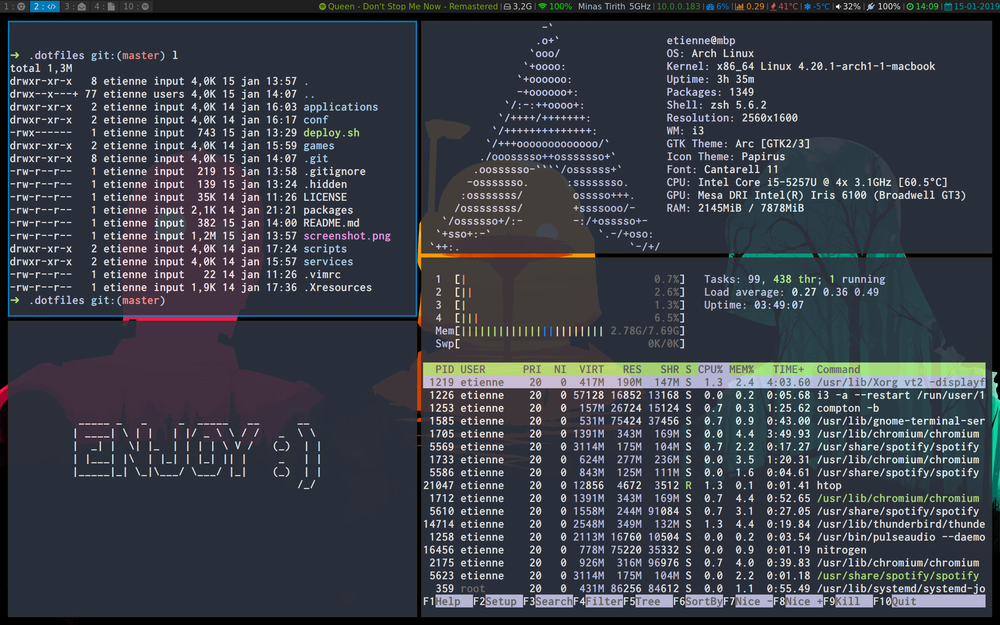

# dotfiles
This is my fancy archlinux mbp config :smile:

## Installation

    $ git clone https://github.com/Monkeet/dotfiles ~/.dotfiles
    $ ~/.dotfiles/scripts/deploy.sh

That's it ! Now reboot your machine :smile:

### Create a list of installed packages

    $ pacman -Qet | cut -d " " -f 1 > packages

### Restore a list of packages (on a new system)

    $ sudo pacman -S $(cat packages)

### If they include aur packages you can

    $ yay -S $(cat packages)
